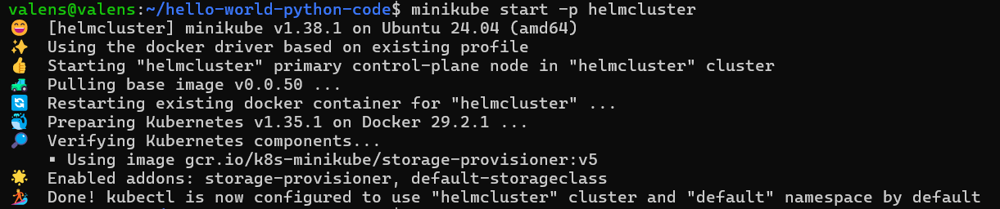
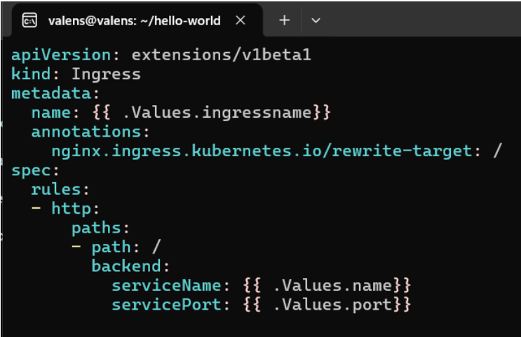
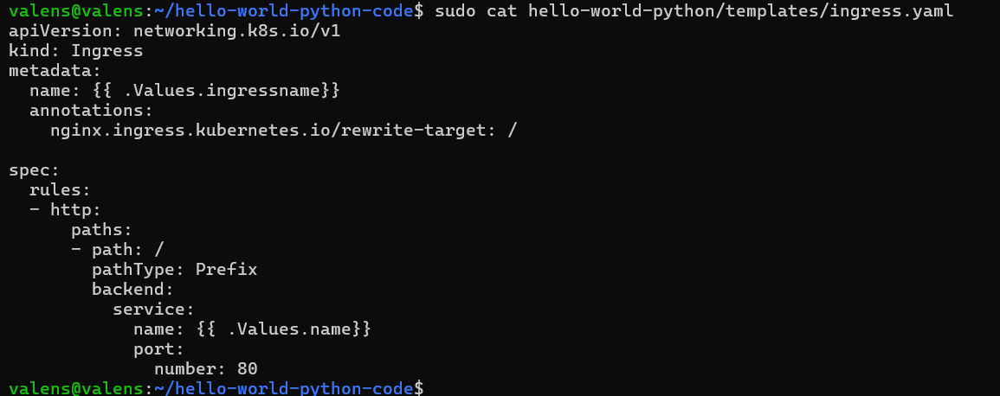
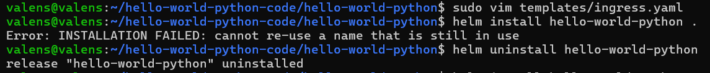
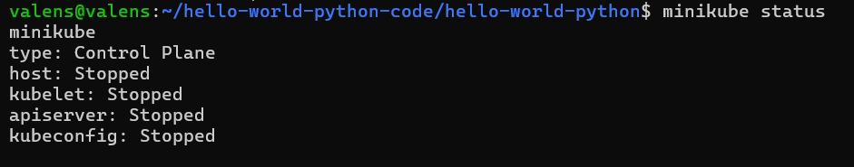
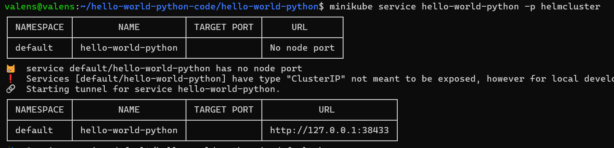

## Helm Deployment
Katerine Valens Orejuela- A00399512

**Objective**

The objective of this practice was to understand how Helm works as a package manager for Kubernetes and to deploy a Python “Hello World” application inside a Kubernetes cluster created with Minikube. During the activity, Helm charts, deployments, services, and ingress resources were configured and executed. Additionally, common deployment errors were identified and solved.

**What is Helm?**

Helm is a package manager for Kubernetes that simplifies the deployment and management of applications inside a cluster. Instead of manually creating multiple YAML files, Helm groups all Kubernetes configurations into a single package called a Chart.

Helm makes deployments easier, reusable, and more organized. It also allows updating applications, rolling back changes, and managing different environments such as development, testing, and production.

**What is a Helm Chart?**
A Helm Chart is a collection of files that describe the Kubernetes resources needed to deploy an application. The chart usually contains:

- Chart.yaml: general information about the chart
- values.yaml: configurable values such as image names and ports
- templates/: Kubernetes YAML templates for deployments, services, and ingress resources

**Procedure**

First, a Minikube cluster called helmcluster was created and started. This command initialized a local Kubernetes cluster using Docker as the driver. After the cluster was successfully started, kubectl was automatically configured to use the new cluster.

During the installation process, an error related to the Ingress resource appeared. The chart was using an outdated Kubernetes API version "extensions/v1beta1". Modern Kubernetes versions no longer support this API. To solve the issue, the ingress template was updated to "networking.k8s.io/v1". Also the path type was added because it is mandatory in recent Kubernetes versions.

The original ingress.yaml was:

The final version for this file is:

Another problem occurred after a failed installation attempt. Helm displayed the error "cannot re-use a name that is still in use". This happened because the release name already existed even though the deployment had failed. The problem was solved by uninstalling and repeating the installation.

Then the application was installed again successfully.

After the deployment was completed, the application service was accessed using:

The -p helmcluster parameter was necessary because the cluster was created with a custom Minikube profile instead of the default one.

**What I Understood About Helm**

From this practice, I understood that Helm simplifies Kubernetes deployments by packaging all the required YAML configurations into a reusable Chart. Instead of manually creating deployments, services, and ingress resources one by one, Helm automates the entire process with a single command. I also understood that Helm allows applications to be upgraded, rolled back, and configured easily, which is very useful in real DevOps and cloud environments.

